# Laravel IoT Platform Documentation

## Table of Contents
- [Introduction](#introduction)
- [System Architecture](#system-architecture)
- [Core Components](#core-components)
- [Data Models](#data-models)
- [API Endpoints](#api-endpoints)
- [MQTT Communication](#mqtt-communication)
- [Security](#security)
- [User-Node Mapping](#user-node-mapping)
- [Time Series Data](#time-series-data)
- [Implementation Guide](#implementation-guide)

## Introduction

This document provides comprehensive documentation for a modern Laravel-based IoT platform that offers REST API services
for mobile clients and supports MQTT communication with IoT devices. The platform is inspired by the
ESP RainMaker concept but designed to be flexible regarding MQTT brokers and device types, supporting Arduino, ESP32,
RP2040, and other microcontrollers.

## System Architecture

The system architecture is designed to be scalable, secure, and flexible to accommodate various IoT use cases.

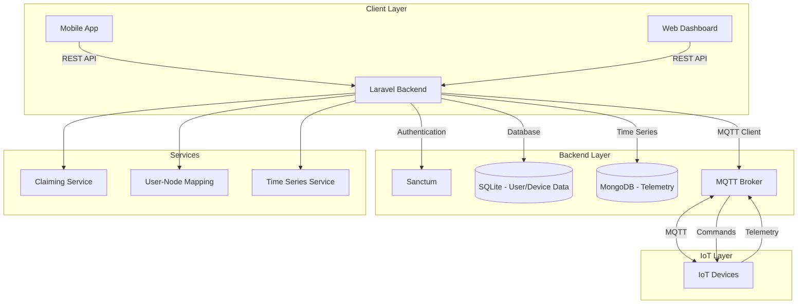

## Core Components

### Backend Components

1. **Laravel 12 Framework**: The core application framework
2. **Sanctum Authentication**: For secure API token-based authentication
3. **MQTT Client**: Using php-mqtt/laravel-client for MQTT communication
4. **Database Layer**:
    - SQLite for user, device, room, automation, and ACL data
    - MongoDB for MQTT messages and telemetry data

### IoT Components

1. **Nodes**: Single ESP32-based products with unique identifiers
2. **Devices**: Logical user-controllable entities (switches, sensors, etc.)
3. **Parameters**: Control and monitoring parameters of devices
4. **Services**: Entities for operations not visible to users (e.g., OTA updates)

## Data Models

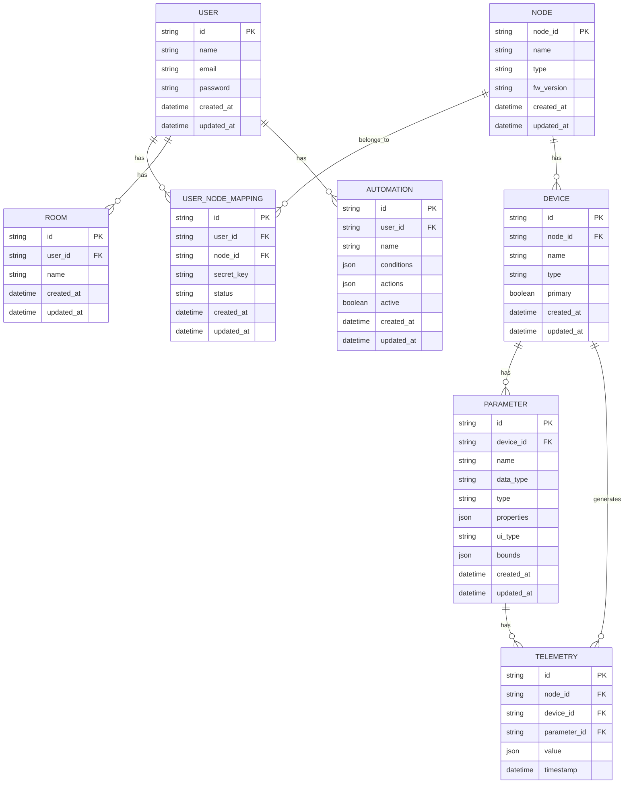

## API Endpoints

### Authentication Endpoints

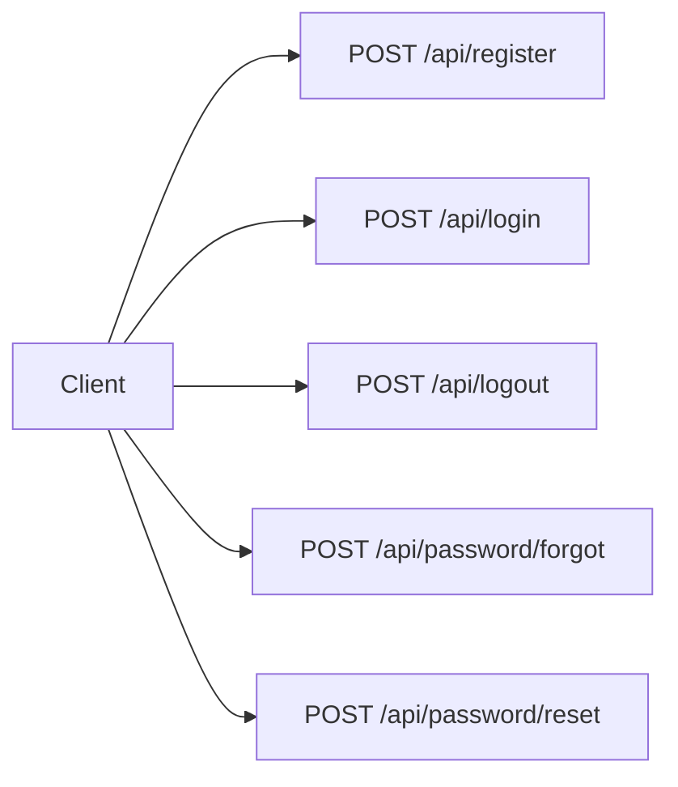

| Endpoint               | Method | Description                        |
|------------------------|--------|------------------------------------|
| `/api/register`        | POST   | Register a new user                |
| `/api/login`           | POST   | Login and get authentication token |
| `/api/logout`          | POST   | Logout and invalidate token        |
| `/api/password/forgot` | POST   | Request password reset             |
| `/api/password/reset`  | POST   | Reset password                     |

### Node Management Endpoints

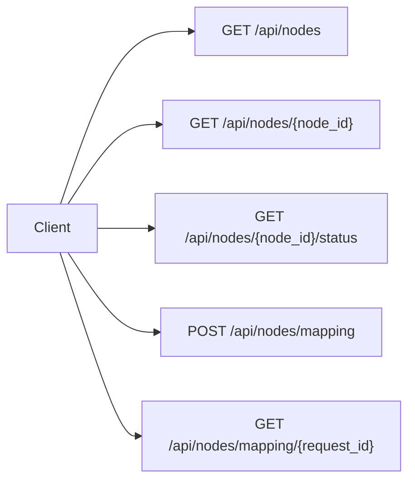

| Endpoint | Method | Description |
|----------|--------|-------------|
| `/api/nodes` | GET | Get all nodes mapped to user |
| `/api/nodes/{node_id}` | GET | Get node configuration |
| `/api/nodes/{node_id}/status` | GET | Get node connectivity status |
| `/api/nodes/mapping` | POST | Create user-node mapping |
| `/api/nodes/mapping/{request_id}` | GET | Check mapping status |

### Device Management Endpoints

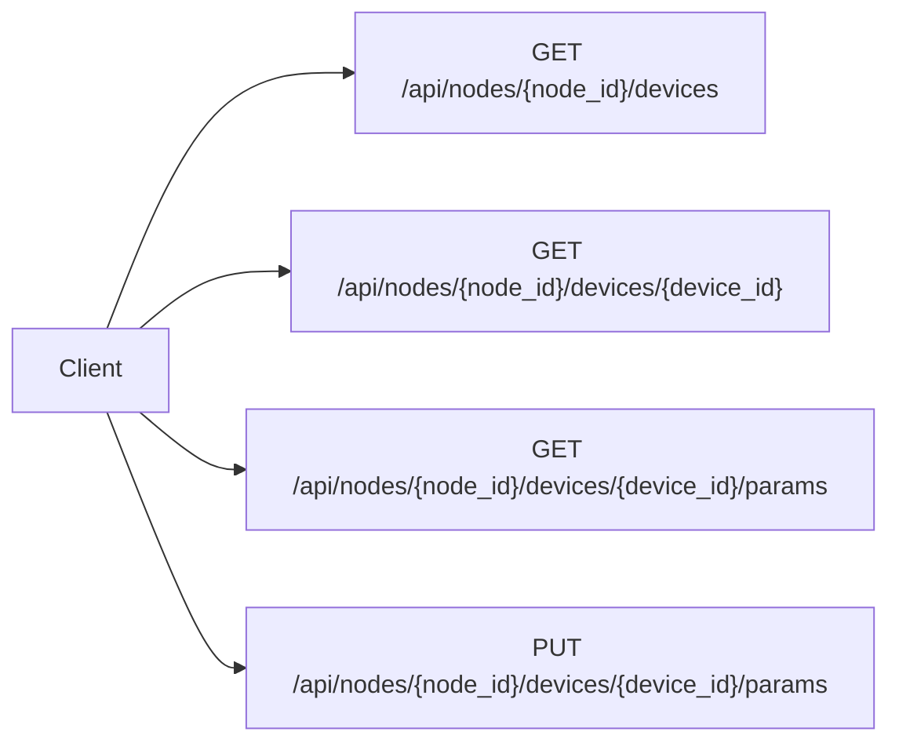

| Endpoint                                          | Method | Description                |
|---------------------------------------------------|--------|----------------------------|
| `/api/nodes/{node_id}/devices`                    | GET    | Get all devices for a node |
| `/api/nodes/{node_id}/devices/{device_id}`        | GET    | Get device details         |
| `/api/nodes/{node_id}/devices/{device_id}/params` | GET    | Get device parameters      |
| `/api/nodes/{node_id}/devices/{device_id}/params` | PUT    | Update device parameters   |

### Room Management Endpoints

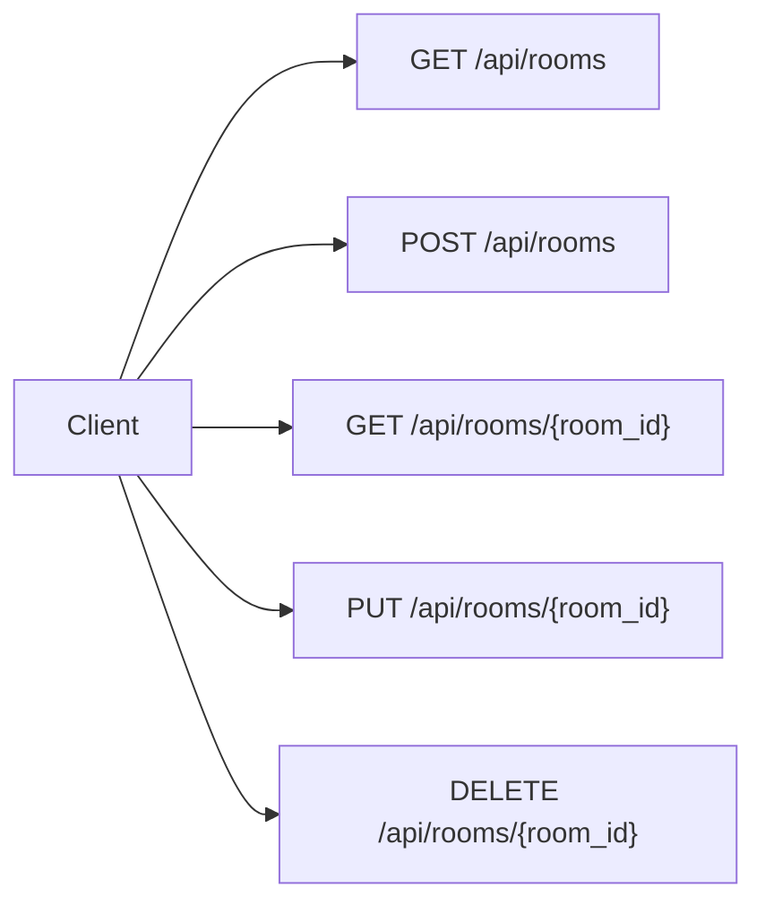

| Endpoint               | Method | Description       |
|------------------------|--------|-------------------|
| `/api/rooms`           | GET    | Get all rooms     |
| `/api/rooms`           | POST   | Create a new room |
| `/api/rooms/{room_id}` | GET    | Get room details  |
| `/api/rooms/{room_id}` | PUT    | Update room       |
| `/api/rooms/{room_id}` | DELETE | Delete room       |

### Automation Endpoints

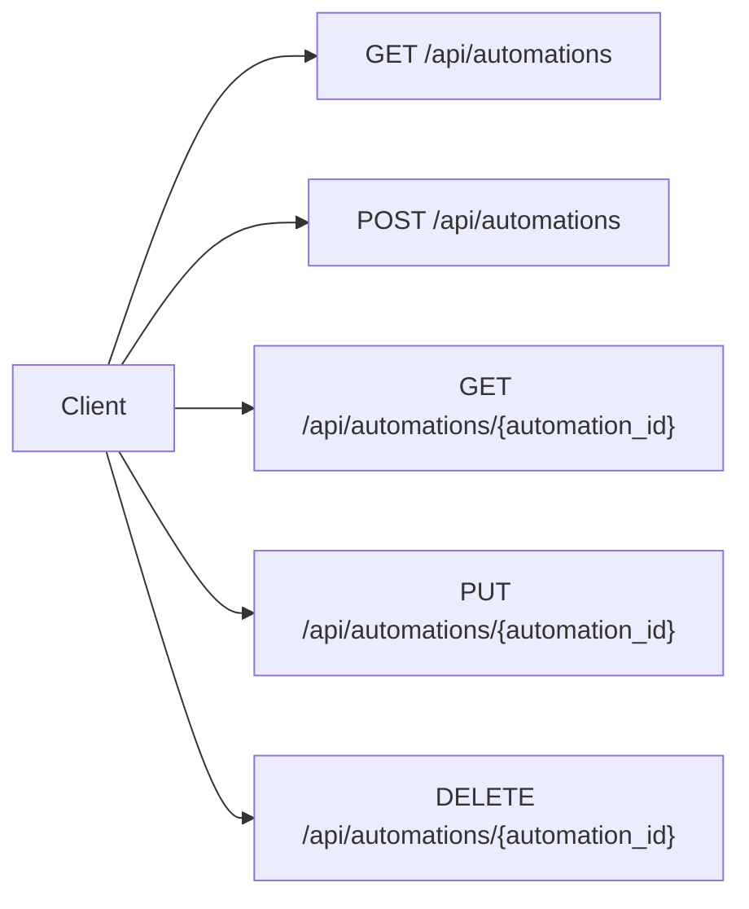

| Endpoint                           | Method | Description             |
|------------------------------------|--------|-------------------------|
| `/api/automations`                 | GET    | Get all automations     |
| `/api/automations`                 | POST   | Create a new automation |
| `/api/automations/{automation_id}` | GET    | Get automation details  |
| `/api/automations/{automation_id}` | PUT    | Update automation       |
| `/api/automations/{automation_id}` | DELETE | Delete automation       |

### Telemetry Endpoints

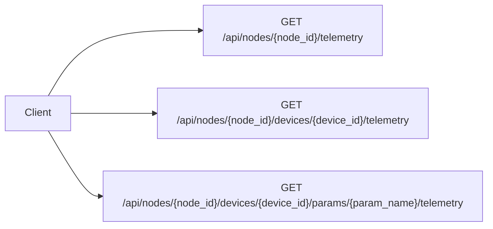

| Endpoint                                                                 | Method | Description                   |
|--------------------------------------------------------------------------|--------|-------------------------------|
| `/api/nodes/{node_id}/telemetry`                                         | GET    | Get telemetry for a node      |
| `/api/nodes/{node_id}/devices/{device_id}/telemetry`                     | GET    | Get telemetry for a device    |
| `/api/nodes/{node_id}/devices/{device_id}/params/{param_name}/telemetry` | GET    | Get telemetry for a parameter |

## MQTT Communication

The platform uses MQTT for communication between the backend and IoT devices. All communication is secured using TLS with X.509 certificate-based mutual authentication.

### MQTT Topics Structure

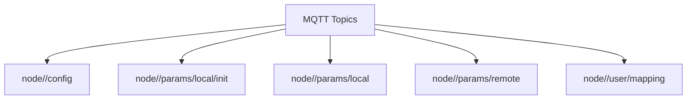

### Node Configuration

When a node boots up, it publishes its configuration to the MQTT broker:

```
Topic: node/<node_id>/config
Operation: PUBLISH
Data: Node configuration JSON object
```

Example node configuration:

```json
{
  "node_id": "5d898491-a498-48ec-9476-a4e23519fe31",
  "config_version": "2023-01-01",
  "info": {
    "name": "Living Room Hub",
    "fw_version": "1.0",
    "type": "Hub"
  },
  "attributes": [
    {
      "name": "serial_num",
      "value": "LRH-123456"
    },
    {
      "name": "model",
      "value": "LRH-2023"
    }
  ],
  "devices": [
    {
      "name": "TemperatureSensor",
      "type": "esp.device.sensor.temperature",
      "primary": "temperature",
      "params": [
        {
          "name": "temperature",
          "data_type": "float",
          "properties": ["read", "time_series"],
          "ui_type": "esp.ui.numeric",
          "bounds": {
            "min": -40,
            "max": 100
          }
        }
      ]
    },
    {
      "name": "SmartLight",
      "type": "esp.device.light",
      "primary": "power",
      "params": [
        {
          "name": "power",
          "data_type": "bool",
          "properties": ["read", "write", "time_series"],
          "ui_type": "esp.ui.toggle"
        },
        {
          "name": "brightness",
          "data_type": "int",
          "properties": ["read", "write"],
          "ui_type": "esp.ui.slider",
          "bounds": {
            "min": 0,
            "max": 100,
            "step": 1
          }
        }
      ]
    }
  ]
}
```

### Parameter Reporting

#### Initial Reporting

When a node boots up, it reports the initial values of all parameters:

```
Topic: node/<node_id>/params/local/init
Operation: PUBLISH
Data: {"<device-name>":{"<param-name>":<value>,...},...}
```

Example:

```json
{
  "TemperatureSensor": {
    "temperature": 22.5
  },
  "SmartLight": {
    "power": false,
    "brightness": 50
  }
}
```

#### Subsequent Reporting

When parameter values change on the device, it reports only the changed values:

```
Topic: node/<node_id>/params/local
Operation: PUBLISH
Data: {"<device-name>":{"<param-name>":<value>,...},...}
```

Example:

```json
{
  "TemperatureSensor": {
    "temperature": 23.1
  }
}
```

#### Remote Control

The node subscribes to this topic to receive commands from the backend:

```
Topic: node/<node_id>/params/remote
Operation: SUBSCRIBE
Data: {"<device-name>":{"<param-name>":<value>,...},...}
```

Example:

```json
{
  "SmartLight": {
    "power": true,
    "brightness": 75
  }
}
```

## Security

### Authentication

1. **API Authentication**: Laravel Sanctum for token-based authentication
2. **MQTT Authentication**: X.509 certificate-based mutual authentication

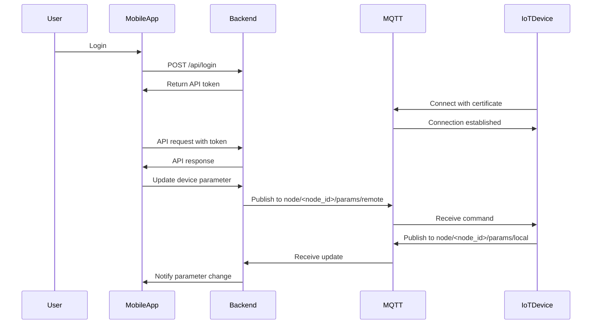

### MQTT Policies

The MQTT policy specifies that a node can establish a connection only if:
- The client ID matches the node ID
- The node is only allowed to subscribe and publish to topics with the prefix `node/<node_id>/`

## User-Node Mapping

Before a node can be monitored and controlled remotely, it must be mapped to a user.

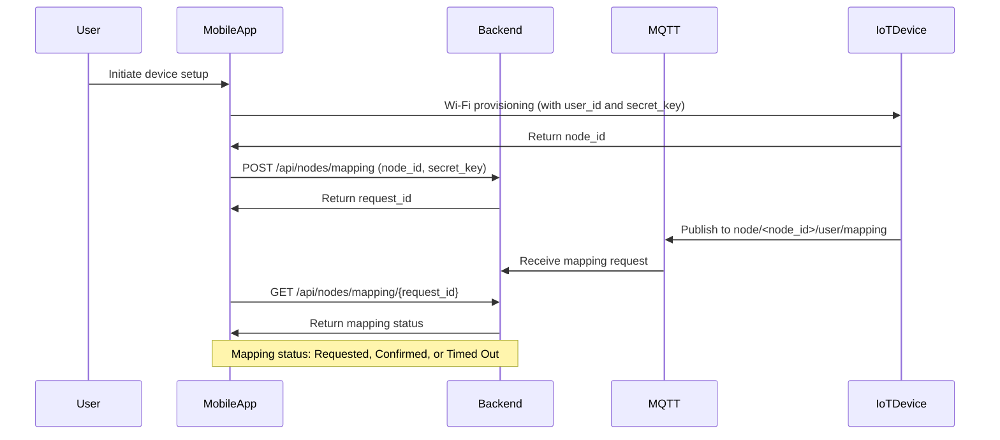

### Mapping Data

```
Topic: node/<node_id>/user/mapping
Operation: PUBLISH
Data: {"node_id":"<node_id>","user_id":"<user_id>","secret_key": "<secret_key>"}
```

Example:

```json
{
  "node_id": "5d898491-a498-48ec-9476-a4e23519fe31",
  "user_id": "02e95749-8d9d-4b8e-972c-43325ad27c63",
  "secret_key": "9140ef1d-72be-48d5-a6a1-455a27d77dee"
}
```

## Time Series Data

The platform supports two types of time series data:

1. **Full-featured Time Series Data**: For values that require complete time-stamped history and operations to find min, max, average, etc. in a given time window.
2. **Simple Time Series Data**: For values that require complete time-stamped history, but without any additional operations.

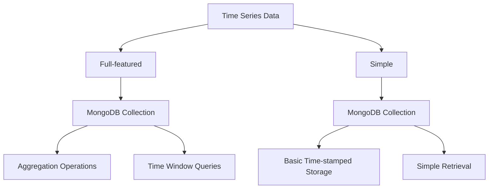

### Time Series Data Structure

```json
{
  "node_id": "5d898491-a498-48ec-9476-a4e23519fe31",
  "device_id": "TemperatureSensor",
  "param_name": "temperature",
  "value": 22.5,
  "timestamp": "2023-04-12T15:30:45.123Z"
}
```
